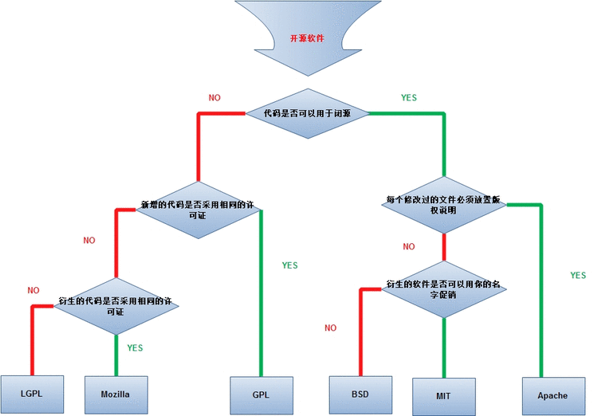

## 协议详解

## mysql简介
### Redis 是完全开源并免费的，遵守BSD协议，是一个高性能的key-value数据库中
### Redis 与其他key-value 缓存产品有以下三个特点
- Redis支持数据的持久化，可以将内存中的数据保存在磁盘中，重启的时候可以再次加载进行使用。
- Redis不仅仅支持简单的key-value类型的数据，同时还提供list，set，zset，hash等数据结构的存储。
- Redis支持数据的备份，即master-slave模式的数据备份

## Redis 优势 
- 性能极高 – Redis能读的速度是110000次/s,写的速度是81000次/s 。
- 丰富的数据类型 – Redis支持二进制案例的 Strings, Lists, Hashes, Sets 及 Ordered Sets 数据类型操作。
- 原子 – Redis的所有操作都是原子性的，意思就是要么成功执行要么失败完全不执行。单个操作是原子性的。多个操作也支持事务，即原子性，通过MULTI和EXEC指令包起来。
- 丰富的特性 – Redis还支持 publish/subscribe, 通知, key 过期等等特性。
```
MySQL是关系型数据库，是持久化存储的，查询检索的话，会涉及到磁盘IO操作，为了提高性能，可以使用缓存技术，而memcached就是内存数据库，数据存储在内存中（当然也可以进行持久化存储），可以用作缓存数据库。用户首先去memcached查询数据，如果未查询到（即缓存未命中），才去MySQL中查询数据，查询到的数据会更新到缓存数据库中，提供给下次可能进行的查询。提高了数据查询方面的性能。
  Redis和memcached都是缓存数据库，可以大大提升高数据量的web访问速度。但是memcached只是提供了简单的数据结构string，而Redis的value可以是string、list、set、hash、sorted set这些，功能更加强大。
  web应用中一般采用MySQL+Redis的方式，web应用每次先访问Redis，如果没有找到数据，才去访问MySQL。
  Redis是内存数据库，数据保存在内存中，访问速度快。MySQL是关系型数据库，功能强大，存储在磁盘中，数据访问速度慢。像memcached，MongoDB，Redis等，都属于No sql系列。
```

----
## 区别
### 1.mysql和redis的数据库类型
- mysql是关系型数据库，主要用于存放持久化数据，将数据存储在硬盘中，读取速度较慢。
- redis是NOSQL，即非关系型数据库，也是缓存数据库，即将数据存储在缓存中，缓存的读取速度快，能够大大的提高运行效率，但是保存时间有限

### mysql的运行机制
- mysql作为持久化存储的关系型数据库，相对薄弱的地方在于每次请求访问数据库时，都存在着I/O操作，如果反复频繁的访问数据库。第一：会在反复链接数据库上花费大量时间，从而导致运行效率过慢；第二：反复的访问数据库也会导致数据库的负载过高，那么此时缓存的概念就衍生了出来。

### 3.缓存
缓存就是数据交换的缓冲区（cache），当浏览器执行请求时，首先会对在缓存中进行查找，如果存在，就获取；否则就访问数据库。
缓存的好处就是读取速度快

### redis数据库
redis数据库就是一款缓存数据库，用于存储使用频繁的数据，这样减少访问数据库的次数，提高运行效率。

### redis和mysql的区别总结
```
（1）类型上
从类型上来说，mysql是关系型数据库，redis是缓存数据库
（2）作用上
mysql用于持久化的存储数据到硬盘，功能强大，但是速度较慢
redis用于存储使用较为频繁的数据到缓存中，读取速度快
（3）需求上
mysql和redis因为需求的不同，一般都是配合使用。
```

### redis数据类型
- String(字符串)
- Hash(哈希)
    Redis hash 是一个键值(key=>value)对集合。hash 特别适合用于存储对象。
- List(列表) 数组
- Set（集合）
    Redis的Set是string类型的无序集合。集合是通过哈希表实现的，所以添加，删除，查找的复杂度都是O(1)。
- zset(sorted set：有序集合)
   Redis zset 和 set 一样也是string类型元素的集合,且不允许重复的成员。
不同的是每个元素都会关联一个double类型的分数。redis正是通过分数来为集合中的成员进行从小到大的排序。
    zset的成员是唯一的,但分数(score)却可以重复。 

### 命令使用
1. 字符串使用方法
```
set name a   设置一个name 等于a的字符串
get name  得到这个值
expire name 5 设置过期时间为5秒
ttl name 查看过期时间
keys * 查看列表
```   
2. Hash使用方法
```
hset obj name a  HSET KEY_NAME FIELD VALUE 将哈希表 key 中的字段 field 的值设为 value 
hget obj name 获取
``` 
3. 列表使用
```
Redis列表是简单的字符串列表，按照插入顺序排序。你可以添加一个元素到列表的头部（左边）或者尾部（右边）
lpush arr1 1 2 3 4 5 6 往数组的左边输入1 2 3 4 5 6
rpush arr1 7 8 9 往数组的右边输入1 2 3 4 5 6
lrange arr1 0 -1 查看所有的 -1 指的是最后一个元素
lrem arr 8 1 从数组arr的检索出8位然后删掉里面的数字1
```
4. Set（集合）
```
sadd hel 1 1 1 1 1  //不能添加重复性的 只能添加1
smembers hel  返回集合中的所有成员
srem hel 1 删除掉集合中的一项
```